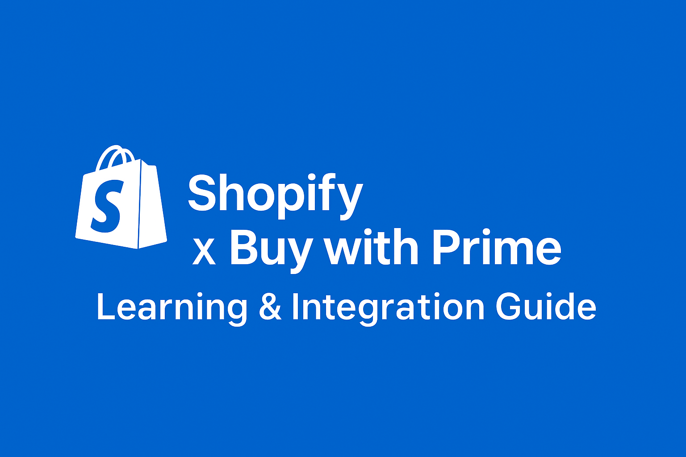

# 🛍️ Shopify Learning Plan – Buy with Prime Integration

> **Author:** Daniela Montero  
> **Purpose:** Strengthen technical expertise in ecommerce integrations to proactively support merchants during the **Buy with Prime** installation process.


---

## 📘 Overview

This document serves as a **professional learning and troubleshooting guide** for mastering Shopify integrations with **Buy with Prime (BwP)**.  
It includes a structured 3-week learning plan, internal troubleshooting documentation, and proactive improvement ideas designed to enhance the merchant onboarding experience.

---

## 🗓️ Week-by-Week Learning Plan

### **Week 1 – Shopify Fundamentals**

| Day | Focus | Resources | Notes |
|-----|--------|------------|-------|
| **Day 1** | Explore Shopify Dashboard and store structure | [Shopify Free Trial](https://www.shopify.com/free-trial) | Create a test store and explore key sections (Products, Orders, Online Store, Apps, Settings). |
| **Day 2** | Learn about themes and templates | [Themes Overview](https://shopify.dev/docs/themes) | Review `layout`, `templates`, and `sections`. Understand how `theme.liquid` works. |
| **Day 3** | Understand Liquid basics | [Liquid Basics](https://shopify.dev/docs/api/liquid) | Practice printing variables and simple conditions. |
| **Day 4** | Learn about Shopify apps & permissions | [Shopify App Store](https://apps.shopify.com/) | Observe app installation flow and permission requests. |
| **Day 5** | Review and document learnings | — | Document installation steps and identify potential confusion points for merchants. |

---

### **Week 2 – Buy with Prime Installation & Troubleshooting**

| Day | Focus | Resources | Notes |
|-----|--------|------------|-------|
| **Day 1** | Install Buy with Prime on your test store | [Official BwP Setup Guide](https://buywithprime.amazon.com/) | Follow installation instructions and observe file changes. |
| **Day 2** | Reinstall & observe app residue | — | Check for leftover code or conflicts after uninstalling. |
| **Day 3** | Compare products with/without BwP enabled | — | Identify checkout and UI differences. |
| **Day 4** | Research common merchant issues | [Shopify Community](https://community.shopify.com/) | Document at least 3 recurring errors and causes. |
| **Day 5** | Build your internal troubleshooting guide | — | Include installation steps, common issues, and quick fixes. |

---

### **Week 3 – Proactive Improvement & Team Enablement**

| Day | Focus | Description |
|-----|--------|-------------|
| **Day 1** | Create merchant pre-installation checklist | Verify plan type, checkout, and inventory sync. |
| **Day 2** | Design internal troubleshooting template | Document structure for issue tracking. |
| **Day 3** | Identify improvement opportunities | Analyze merchant pain points and suggest optimizations. |
| **Day 4** | Prepare a professional presentation/report | Summarize findings, improvements, and proposals. |
| **Day 5** | Wrap-up & reflection | Review what you’ve learned and your next learning goals (APIs, Webhooks, etc). |

---

## 🧠 Key Concepts & Notes

Use this section to summarize key Shopify and Buy with Prime concepts you’ve learned.

```text
- Theme structure and Liquid basics
- Integration touchpoints (checkout, product page)
- App installation flow and permissions
- Common merchant pain points
